# Memory Profiling For Mere Mortals 

#### Or why Bobby Shouldnt be so Greedy

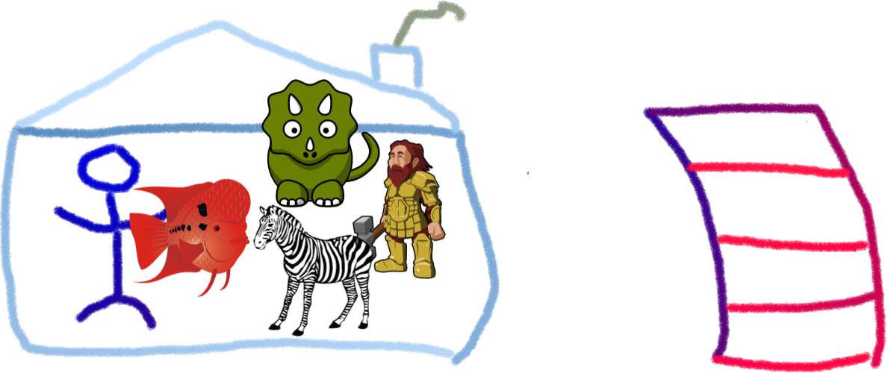

<p style="text-align: center;">
  <small><a href="http://thlorenz.com">Thorsten Lorenz</a></small>
</p>
<p style="text-align: center;">
  <small>twitter <a href="http://twitter.com/thlorenz">@thlorenz</a>  |  github  <a href="http://github/thlorenz">@thlorenz</a>  |  irc  thlorenz</small>
</p>

# Toy Story

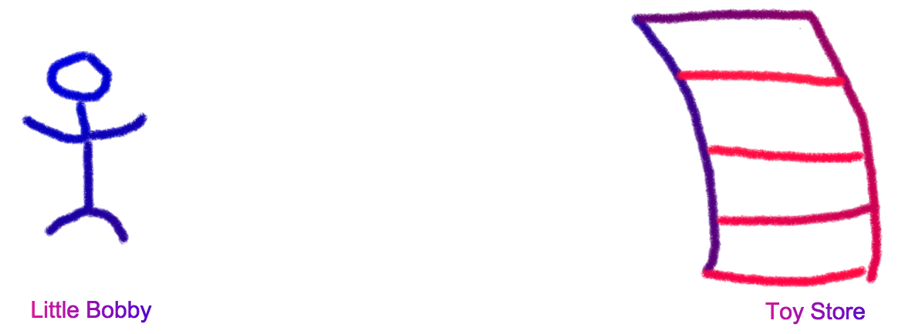

# Toy Story


# Toy Story


# Toy Story

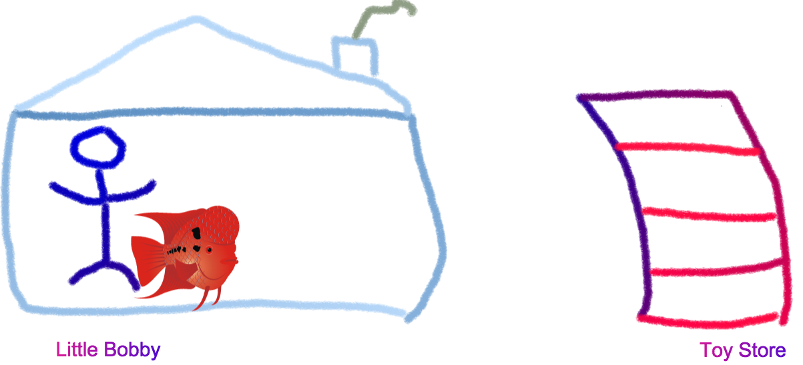

# Toy Story

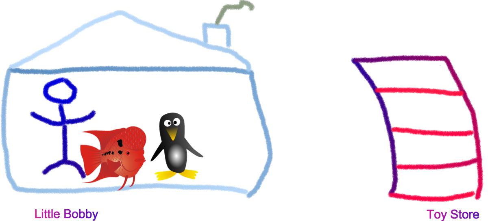

# Toy Story


# Toy Story

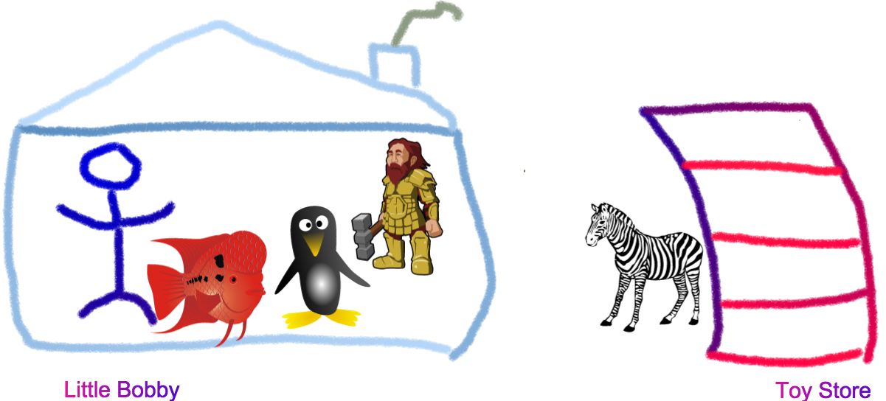

# Toy Story


# Toy Story


# Toy Story


# Toy Story

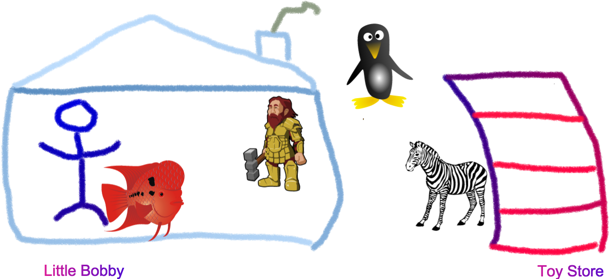

# Toy Story

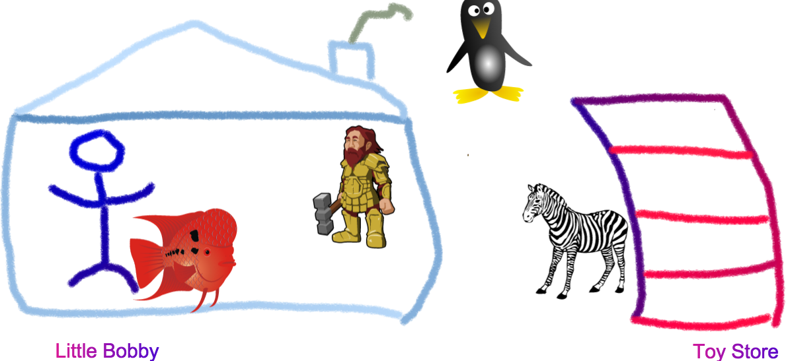

# Toy Story


# Toy Story

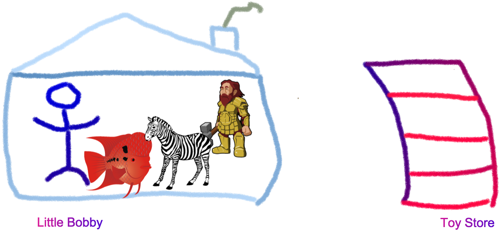

<!--
- triceratops (threehorned dinosaur)
-->

# Toy Story


# Toy Story


# Toy Story

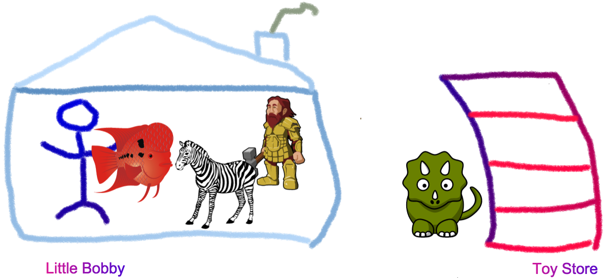

# Toy Story


# HUH?


# Server

```js
var http           = require(http)
  , fs             = require(fs)
  , path           = require(path)
  , templateEngine = require(any-template-engine)

var header = fs.readFileSync(path.join(__dirname, my-header.html), utf8)

// [ ...]

function onrequest(req, res) {
  var context = getContext(req);

  fs.readFile(path.join(__dirname, index.html), utf8, function onreadIndex(err, src) {
    if (err) return console.error(err)
    var html = header + templateEngine(src, context)
    serve(html)
  })
}
```


# Server

## House and Chimney

```js
var http           = require(http)
  , fs             = require(fs)
  , path           = require(path)
  , templateEngine = require(any-template-engine)

var header = fs.readFileSync(path.join(__dirname, my-header.html), utf8)
```

# Server

## House and Chimney

```js
var http           = require(http)
  , fs             = require(fs)
  , path           = require(path)
  , templateEngine = require(any-template-engine)

var header = fs.readFileSync(path.join(__dirname, my-header.html), utf8)
```

- `require`d modules and static header are **created once** and stay in memory for the life time of the server

<!-- notes
- these are shared for each processed request
-->

# Server

## Toys

```js
function onrequest(req, res) {
  var context = getContext(req);

  fs.readFile(path.join(__dirname, index.html), utf8, function onreadIndex(err, src) {
    if (err) return console.error(err)
    var html = header + templateEngine(src, context)
    serve(html)
  })
}
```

# Server

## Toys

```js
function onrequest(req, res) {
  var context = getContext(req);

  fs.readFile(path.join(__dirname, index.html), utf8, function onreadIndex(err, src) {
    if (err) return console.error(err)
    var html = header + templateEngine(src, context)
    serve(html)
  })
}
```

- resources like `context` and `src` of `index.html` are **created for each request**

# Server

## Toys

```js
function onrequest(req, res) {
  var context = getContext(req);

  fs.readFile(path.join(__dirname, index.html), utf8, function onreadIndex(err, src) {
    if (err) return console.error(err)
    var html = header + templateEngine(src, context)
    serve(html)
  })
}
```

- resources like `context` and `src` of `index.html` are **created for each request**
- should not stay in memory after processing request is finished **either with success or failure**

# Memory Leak

> In an environment in which memory is managed by a garbage collector, a memory leak occurs when references to objects
> are retained even though they are no longer needed by your program.

# Memory Leak

> In an environment in which memory is managed by a garbage collector, a memory leak occurs when references to objects
> are retained even though they are no longer needed by your program.

- especially bad if those objects are created during an action that is repeated often, like serving a request

# Memory Leak

> In an environment in which memory is managed by a garbage collector, a memory leak occurs when references to objects
> are retained even though they are no longer needed by your program.


<!-- notes
- if Bobby was to hold on to each fish he gets and keep them in an aquarium itd flow over at some point
-->

# Memory Leak

> Im not Bobby, I release what I no longer need

# Memory Leak


# Memory Leak Causes

1. registered event handlers

<!-- notes
- specifically relating to node
- in the browser its different (mostly DOM nodes hanging around)
-->

# Memory Leak Causes

1. registered event handlers
2. function closures 

# Memory Leak Causes

1. registered event handlers
2. function closures 
3. registered event handlers

# Memory Leak Causes

1. registered event handlers
2. function closures 
3. registered event handlers
4. leaking connections  

<!-- notes
- i.e. when a request fails but the connection isnt properly cleaned up
-->

# Garbage Collector

- follows *retaining path* from a *GC root* to an object
- if no such path exists, object is **unreachable** and subject to being collected

# Garbage Collector

- what is a *Root* and that *retaining path* you speak about?

 


# Garbage Collector


[devtools/javascript-memory-profiling](https://developer.chrome.com/devtools/docs/javascript-memory-profiling)

# Garbage Collector


- node **1** is the *Root* node that *dominates* all other nodes

# Garbage Collector


- node **8** and **7** reference no other nodes, there *retaining size* is equal to its *shallow size* 
- node **6** retains node **8**, therefore its *retaining size* is the it's own *shallow size* plus the *retaining size* of node **8**

# Garbage Collector


- nodes **9** and **10** are not reachable via the *Root* node and therefore are orphaned and subject to garbage
  collection

# Garbage Collector


- if we keep referencing nodes we no longer need we got ourselves a memory leak

# Trouble Shooting Leaks

1. Reproduce (sometimes watching process with *top* suffices)

# Trouble Shooting Leaks

## Demo Time


<!-- notes
- crash process
- increasing memory by itself doesnt prove leak until it hits 1.5GB
- increasing memory although we repeatedly trigger garbage collection indicates a leak
- only once you reach 1.5G do you prove you have a leak since v8 is does not aggressively collect for perf reasons
- 1.5GB is heap allocated by v8 per Isolate, i.e. Tab or in our case Node.js process
-->

# Trouble Shooting Leaks

1. Reproduce (sometimes watching process with *top* suffices)
2. Isolate and find Culprit (various approaches and tools like *Instruments* and *DevTools*)

# Trouble Shooting Leaks

## Steps

1. Take *bottom line* snapshot *Checkpoint 1*
2. Perform operation that might cause a leak followed by GC
3. Take snapshot *Checkpoint 2*
4. Perform same operation as in *2.* followed by GC
5. Take snapshot *Checkpoint 3*
6. Repeat as often as you want in order to collect as many snapshots as you need

# Trouble Shooting Leaks

## Demo Time


<!-- notes
- Instruments and DevTools using heapdump module

- Instruments 
  - to look at things from a C++ perspective (a bit faster than taking heapdumps right away)
-->


# Trouble Shooting Leaks

## IMPORTANT!!!

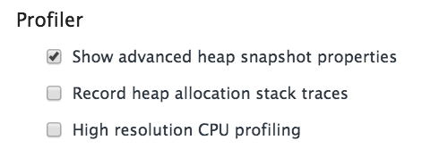

# Trouble Shooting Leaks

## Demo Time


<!-- notes
- DevTools 
  - show Object Allocation Tracker
  - show closures
  - show retainer view
  - mention function closures problem
  - mention naming function declarations to show up in heapdump

- functions shown in Instruments show what function caused object to be allocated
- functions shown in DevTools are closing over allocated objects and prevent them from being collected

-->

# Trouble Shooting Leaks

1. Reproduce (sometimes watching process with *top* suffices)
2. Isolate and find Culprit (various approaches and tools like *Instruments* and *DevTools*)
3. Fix the Leak :) [example code](https://github.com/thlorenz/talks/tree/gh-pages/memory-profiling/example)

# Considerations


# Name Your Functions

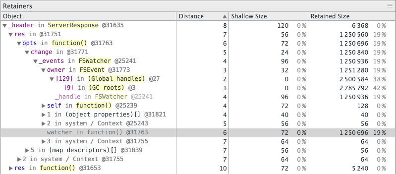

# Name Your Functions


# Name Your Functions

```js
var foo = function () {}
```

# Name Your Functions


# Name Your Functions

```js
var foo = function () {}
```

```js
var foo = function foo() {}
```

# Name Your Functions

```js
Bar.prototype.foo = function () {}
```

# Name Your Functions


# Name Your Functions

```js
Bar.prototype.foo = function () {}
```

```js
Bar.prototype.foo = function foo() {}
```

# Name Your Functions

```js
fs.readFile(file, function (err, src) {
})
```

# Name Your Functions


# Name Your Functions

```js
fs.readFile(file, function (err, src) {
})
```

```js
fs.readFile(file, function onreadFile(err, src) {
})
```

# Resources

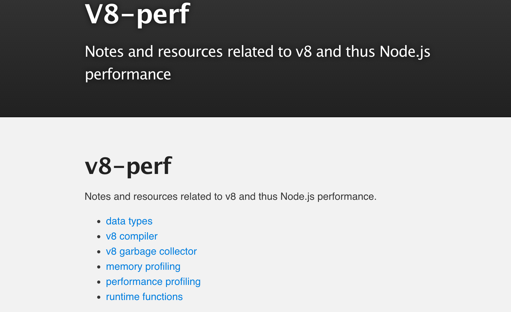

[thlorenz.github.io/v8-perf/](https://thlorenz.github.io/v8-perf/)

# Thanks!

<p style="text-align: center;">
  
</p>
<p style="text-align: center;">
  <small><a href="http://thlorenz.com">thorsten lorenz</a></small>
</p>
<p style="text-align: center;">
  <small>twitter <a href="http://twitter.com/thlorenz">@thlorenz</a>  |  github  <a href="http://github/thlorenz">@thlorenz</a>  |  irc  thlorenz</small>
</p>
