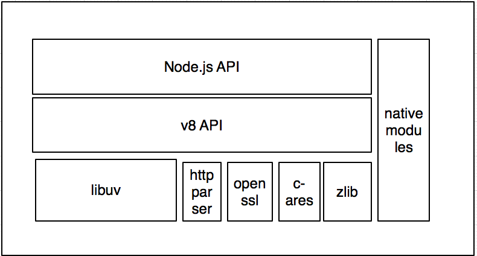

# going native

# What Is a Node.js Addon?

- any library that needs to access C/C++ functionality

# What Is a Node.js Addon?

- Node.js modules work like an addons

# Nodejs Addons in Relation to the Nodejs Architecture



- roughly 50% C++ and 50% JavaScript

# Looking at Node.js

```
~/dev/js/node
➝  ls deps
cares       http_parser mdb_v8      npm         openssl     uv          v8          zlib
```

# Looking at Node.js

- embedds v8 to *run* JavaScript
- calls out to **libuv** to handle system calls
- additional libraries used for other tasks, i.e. **http-parser**

# fs module

- `/lib/fs.js` *binds* `/src/file.cc`

# fs module

```js
// fs.js
var binding = process.binding('fs');
```

# fs module

```cpp
// file.cc
void InitFs(Handle<Object> target,
            Handle<Value> unused,
            Handle<Context> context,
            void* priv) {

  NODE_SET_METHOD(target, "close", Close);
  NODE_SET_METHOD(target, "open", Open);
  // ...
  NODE_SET_METHOD(target, "readdir", ReadDir);
}
NODE_MODULE_CONTEXT_AWARE_BUILTIN(fs, node::InitFs)
```

# fs module

- allows creating 'fs' object in JavaScript land with methods like `readdir`
- calling `fs.readdir` calls C++ `ReadDir` passing along JS parameters in `args` array

# fs module

```js
// fs.js
fs.readdir = function(path, callback) {
  callback = makeCallback(callback);
  if (!nullCheck(path, callback)) return;
  binding.readdir(pathModule._makeLong(path), callback);
};
```

# fs module

```js
// fs.js
fs.readdirSync = function(path) {
  nullCheck(path);
  return binding.readdir(pathModule._makeLong(path));
};
```

# fs module

```cpp
// file.cc
static void ReadDir(const FunctionCallbackInfo<Value>& args) {
  HandleScope scope(env->isolate());

  // ...

  node::Utf8Value path(args[0]);

  if (args[1]->IsFunction()) {
    ASYNC_CALL(readdir, args[1], *path, 0 /*flags*/)
  } else {
    SYNC_CALL(readdir, *path, *path, 0 /*flags*/)

    char* namebuf = static_cast<char*>(SYNC_REQ.ptr);
    uint32_t nnames = SYNC_REQ.result;
    Local<Array> names = Array::New(env->isolate(), nnames);

    for (uint32_t i = 0; i < nnames; ++i) {
      names->Set(i, String::NewFromUtf8(env->isolate(), namebuf));
      namebuf += strlen(namebuf) + 1;
    }

    args.GetReturnValue().Set(names);
  }
}
```

# readdirSync

```cpp
#define SYNC_DEST_CALL(func, path, dest, ...)             \
  fs_req_wrap req_wrap;                                   \
  int err = uv_fs_ ## func(env->event_loop(),             \
                         &req_wrap.req,                   \
                         __VA_ARGS__,                     \
                         NULL);                           \
  if (err < 0) {                                          \
    if (dest != NULL &&                                   \
        (err == UV_EEXIST ||                              \
         err == UV_ENOTEMPTY ||                           \
         err == UV_EPERM)) {                              \
      return env->ThrowUVException(err, #func, "", dest); \
    } else {                                              \
      return env->ThrowUVException(err, #func, "", path); \
    }                                                     \
  }
```

# readdirSync


WHAT???

# Docs

- [addons documentation](https://nodejs.org/api/addons.html)

# Workshop

## OSX and Linux

```
npm install -g goingnative
```

## Docker Option

Clone [docker goingnative](https://github.com/thlorenz/docker.going-native) and follow the instructions.

```sh
./build
```

```sh
./goingnative
```

## Windows

- [interactive nodeschool](http://generalhenry.com/goingnative)
